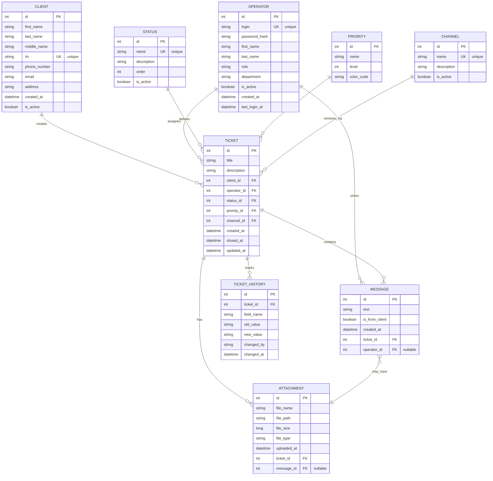

# ER-диаграмма базы данных CRM системы

## Визуальная ER-диаграмма (Entity-Relationship Diagram)



---

## Таблица 1: CLIENT (Клиенты)

| Поле | Тип | Ограничения | Описание |
|------|-----|-------------|---------|
| **id** | INT | PRIMARY KEY, AUTO_INCREMENT | Уникальный идентификатор |
| **first_name** | VARCHAR(100) | NOT NULL | Имя клиента |
| **last_name** | VARCHAR(100) | NOT NULL | Фамилия клиента |
| **middle_name** | VARCHAR(100) | NULLABLE | Отчество |
| **iin** | VARCHAR(12) | UNIQUE, NOT NULL | Индивидуальный идентификационный номер |
| **phone_number** | VARCHAR(20) | NOT NULL | Номер телефона |
| **email** | VARCHAR(255) | NULLABLE | Email адрес |
| **address** | TEXT | NULLABLE | Адрес проживания |
| **created_at** | TIMESTAMP | DEFAULT NOW() | Дата создания записи |
| **is_active** | BOOLEAN | DEFAULT TRUE | Статус активности |

**SQL:**
```sql
CREATE TABLE client (
    id SERIAL PRIMARY KEY,
    first_name VARCHAR(100) NOT NULL,
    last_name VARCHAR(100) NOT NULL,
    middle_name VARCHAR(100),
    iin VARCHAR(12) UNIQUE NOT NULL,
    phone_number VARCHAR(20) NOT NULL,
    email VARCHAR(255),
    address TEXT,
    created_at TIMESTAMP DEFAULT CURRENT_TIMESTAMP,
    is_active BOOLEAN DEFAULT TRUE
);
```

---

## Таблица 2: OPERATOR (Операторы)

| Поле | Тип | Ограничения | Описание |
|------|-----|-------------|---------|
| **id** | INT | PRIMARY KEY, AUTO_INCREMENT | Уникальный идентификатор |
| **login** | VARCHAR(50) | UNIQUE, NOT NULL | Учетное имя оператора |
| **password_hash** | VARCHAR(255) | NOT NULL | Хеш пароля (BCrypt) |
| **first_name** | VARCHAR(100) | NOT NULL | Имя оператора |
| **last_name** | VARCHAR(100) | NOT NULL | Фамилия оператора |
| **role** | VARCHAR(50) | NOT NULL | Роль (Operator, SeniorOperator, Admin) |
| **department** | VARCHAR(100) | NULLABLE | Департамент |
| **is_active** | BOOLEAN | DEFAULT TRUE | Активен ли оператор |
| **created_at** | TIMESTAMP | DEFAULT NOW() | Дата создания |
| **last_login_at** | TIMESTAMP | NULLABLE | Время последнего входа |

**SQL:**
```sql
CREATE TABLE operator (
    id SERIAL PRIMARY KEY,
    login VARCHAR(50) UNIQUE NOT NULL,
    password_hash VARCHAR(255) NOT NULL,
    first_name VARCHAR(100) NOT NULL,
    last_name VARCHAR(100) NOT NULL,
    role VARCHAR(50) NOT NULL,
    department VARCHAR(100),
    is_active BOOLEAN DEFAULT TRUE,
    created_at TIMESTAMP DEFAULT CURRENT_TIMESTAMP,
    last_login_at TIMESTAMP
);
```

---

## Таблица 3: STATUS (Статусы)

| Поле | Тип | Ограничения | Описание |
|------|-----|-------------|---------|
| **id** | INT | PRIMARY KEY, AUTO_INCREMENT | Уникальный идентификатор |
| **name** | VARCHAR(50) | UNIQUE, NOT NULL | Название статуса |
| **description** | TEXT | NULLABLE | Описание статуса |
| **order** | INT | NOT NULL | Порядок в workflow |
| **is_active** | BOOLEAN | DEFAULT TRUE | Активен ли статус |

**Предзаполненные значения:**
- 1: New (Новое)
- 2: InProgress (В обработке)
- 3: WaitingClient (Ожидание клиента)
- 4: Resolved (Решено)
- 5: Closed (Закрыто)

**SQL:**
```sql
CREATE TABLE status (
    id SERIAL PRIMARY KEY,
    name VARCHAR(50) UNIQUE NOT NULL,
    description TEXT,
    "order" INT NOT NULL,
    is_active BOOLEAN DEFAULT TRUE
);

INSERT INTO status (name, description, "order") VALUES
('New', 'Новое обращение', 1),
('InProgress', 'В обработке', 2),
('WaitingClient', 'Ожидание клиента', 3),
('Resolved', 'Решено', 4),
('Closed', 'Закрыто', 5);
```

---

## Таблица 4: PRIORITY (Приоритеты)

| Поле | Тип | Ограничения | Описание |
|------|-----|-------------|---------|
| **id** | INT | PRIMARY KEY, AUTO_INCREMENT | Уникальный идентификатор |
| **name** | VARCHAR(50) | NOT NULL | Название приоритета |
| **level** | INT | NOT NULL | Уровень (1-4) для SLA |
| **color_code** | VARCHAR(7) | NULLABLE | HEX код цвета для UI |

**Предзаполненные значения:**
- 1: Low (Низкий) - #4CAF50 (зеленый)
- 2: Medium (Средний) - #FFC107 (желтый)
- 3: High (Высокий) - #FF9800 (оранжевый)
- 4: Critical (Критический) - #F44336 (красный)

**SQL:**
```sql
CREATE TABLE priority (
    id SERIAL PRIMARY KEY,
    name VARCHAR(50) NOT NULL,
    level INT NOT NULL,
    color_code VARCHAR(7)
);

INSERT INTO priority (name, level, color_code) VALUES
('Low', 1, '#4CAF50'),
('Medium', 2, '#FFC107'),
('High', 3, '#FF9800'),
('Critical', 4, '#F44336');
```

---

## Таблица 5: CHANNEL (Каналы)

| Поле | Тип | Ограничения | Описание |
|------|-----|-------------|---------|
| **id** | INT | PRIMARY KEY, AUTO_INCREMENT | Уникальный идентификатор |
| **name** | VARCHAR(100) | UNIQUE, NOT NULL | Название канала |
| **description** | TEXT | NULLABLE | Описание канала |
| **is_active** | BOOLEAN | DEFAULT TRUE | Активен ли канал |

**Предзаполненные значения:**
- 1: CallCenter (Колл-центр)
- 2: Chat (Чат)
- 3: Email (Email)
- 4: MobileApp (Мобильное приложение)
- 5: Website (Веб-сайт)

**SQL:**
```sql
CREATE TABLE channel (
    id SERIAL PRIMARY KEY,
    name VARCHAR(100) UNIQUE NOT NULL,
    description TEXT,
    is_active BOOLEAN DEFAULT TRUE
);

INSERT INTO channel (name, description) VALUES
('CallCenter', 'Обращение через колл-центр'),
('Chat', 'Обращение через чат'),
('Email', 'Обращение через email'),
('MobileApp', 'Обращение через мобильное приложение'),
('Website', 'Обращение через веб-сайт');
```

---

## Таблица 6: TICKET (Обращения)

| Поле | Тип | Ограничения | Описание |
|------|-----|-------------|---------|
| **id** | INT | PRIMARY KEY, AUTO_INCREMENT | Уникальный идентификатор |
| **title** | VARCHAR(200) | NOT NULL | Название обращения |
| **description** | TEXT | NOT NULL | Описание проблемы |
| **client_id** | INT | FOREIGN KEY (client.id), NOT NULL | Ссылка на клиента |
| **operator_id** | INT | FOREIGN KEY (operator.id), NULLABLE | Ссылка на назначенного оператора |
| **status_id** | INT | FOREIGN KEY (status.id), NOT NULL | Статус обращения |
| **priority_id** | INT | FOREIGN KEY (priority.id), NOT NULL | Приоритет обращения |
| **channel_id** | INT | FOREIGN KEY (channel.id), NOT NULL | Канал поступления |
| **created_at** | TIMESTAMP | DEFAULT NOW() | Дата создания |
| **closed_at** | TIMESTAMP | NULLABLE | Дата закрытия |
| **updated_at** | TIMESTAMP | DEFAULT NOW() | Дата последнего обновления |

**SQL:**
```sql
CREATE TABLE ticket (
    id SERIAL PRIMARY KEY,
    title VARCHAR(200) NOT NULL,
    description TEXT NOT NULL,
    client_id INT NOT NULL,
    operator_id INT,
    status_id INT NOT NULL,
    priority_id INT NOT NULL,
    channel_id INT NOT NULL,
    created_at TIMESTAMP DEFAULT CURRENT_TIMESTAMP,
    closed_at TIMESTAMP,
    updated_at TIMESTAMP DEFAULT CURRENT_TIMESTAMP,
    FOREIGN KEY (client_id) REFERENCES client(id) ON DELETE CASCADE,
    FOREIGN KEY (operator_id) REFERENCES operator(id) ON DELETE SET NULL,
    FOREIGN KEY (status_id) REFERENCES status(id),
    FOREIGN KEY (priority_id) REFERENCES priority(id),
    FOREIGN KEY (channel_id) REFERENCES channel(id)
);

CREATE INDEX idx_ticket_client_id ON ticket(client_id);
CREATE INDEX idx_ticket_operator_id ON ticket(operator_id);
CREATE INDEX idx_ticket_status_id ON ticket(status_id);
CREATE INDEX idx_ticket_created_at ON ticket(created_at);
```

---

## Таблица 7: MESSAGE (Сообщения)

| Поле | Тип | Ограничения | Описание |
|------|-----|-------------|---------|
| **id** | INT | PRIMARY KEY, AUTO_INCREMENT | Уникальный идентификатор |
| **text** | TEXT | NOT NULL (max 2000 символов) | Текст сообщения |
| **is_from_client** | BOOLEAN | NOT NULL | TRUE если от клиента, FALSE если от оператора |
| **created_at** | TIMESTAMP | DEFAULT NOW() | Дата создания |
| **ticket_id** | INT | FOREIGN KEY (ticket.id), NOT NULL | Ссылка на обращение |
| **operator_id** | INT | FOREIGN KEY (operator.id), NULLABLE | Ссылка на оператора (если от оператора) |

**SQL:**
```sql
CREATE TABLE message (
    id SERIAL PRIMARY KEY,
    text TEXT NOT NULL,
    is_from_client BOOLEAN NOT NULL,
    created_at TIMESTAMP DEFAULT CURRENT_TIMESTAMP,
    ticket_id INT NOT NULL,
    operator_id INT,
    FOREIGN KEY (ticket_id) REFERENCES ticket(id) ON DELETE CASCADE,
    FOREIGN KEY (operator_id) REFERENCES operator(id) ON DELETE SET NULL
);

CREATE INDEX idx_message_ticket_id ON message(ticket_id);
CREATE INDEX idx_message_created_at ON message(created_at);
```

---

## Таблица 8: ATTACHMENT (Прикрепленные файлы)

| Поле | Тип | Ограничения | Описание |
|------|-----|-------------|---------|
| **id** | INT | PRIMARY KEY, AUTO_INCREMENT | Уникальный идентификатор |
| **file_name** | VARCHAR(255) | NOT NULL | Имя файла |
| **file_path** | TEXT | NOT NULL | Путь к файлу на сервере |
| **file_size** | BIGINT | NOT NULL | Размер файла в байтах |
| **file_type** | VARCHAR(100) | NOT NULL | MIME тип файла |
| **uploaded_at** | TIMESTAMP | DEFAULT NOW() | Дата загрузки |
| **ticket_id** | INT | FOREIGN KEY (ticket.id), NOT NULL | Ссылка на обращение |
| **message_id** | INT | FOREIGN KEY (message.id), NULLABLE | Ссылка на сообщение |

**SQL:**
```sql
CREATE TABLE attachment (
    id SERIAL PRIMARY KEY,
    file_name VARCHAR(255) NOT NULL,
    file_path TEXT NOT NULL,
    file_size BIGINT NOT NULL,
    file_type VARCHAR(100) NOT NULL,
    uploaded_at TIMESTAMP DEFAULT CURRENT_TIMESTAMP,
    ticket_id INT NOT NULL,
    message_id INT,
    FOREIGN KEY (ticket_id) REFERENCES ticket(id) ON DELETE CASCADE,
    FOREIGN KEY (message_id) REFERENCES message(id) ON DELETE CASCADE
);

CREATE INDEX idx_attachment_ticket_id ON attachment(ticket_id);
```

---

## Таблица 9: TICKET_HISTORY (История изменений обращений)

| Поле | Тип | Ограничения | Описание |
|------|-----|-------------|---------|
| **id** | INT | PRIMARY KEY, AUTO_INCREMENT | Уникальный идентификатор |
| **ticket_id** | INT | FOREIGN KEY (ticket.id), NOT NULL | Ссылка на обращение |
| **field_name** | VARCHAR(100) | NOT NULL | Название измененного поля |
| **old_value** | TEXT | NULLABLE | Старое значение |
| **new_value** | TEXT | NULLABLE | Новое значение |
| **changed_by** | VARCHAR(100) | NOT NULL | Кто выполнил изменение |
| **changed_at** | TIMESTAMP | DEFAULT NOW() | Дата и время изменения |

**SQL:**
```sql
CREATE TABLE ticket_history (
    id SERIAL PRIMARY KEY,
    ticket_id INT NOT NULL,
    field_name VARCHAR(100) NOT NULL,
    old_value TEXT,
    new_value TEXT,
    changed_by VARCHAR(100) NOT NULL,
    changed_at TIMESTAMP DEFAULT CURRENT_TIMESTAMP,
    FOREIGN KEY (ticket_id) REFERENCES ticket(id) ON DELETE CASCADE
);

CREATE INDEX idx_ticket_history_ticket_id ON ticket_history(ticket_id);
CREATE INDEX idx_ticket_history_changed_at ON ticket_history(changed_at);
```

---

## Связи между таблицами (Relationships)

### One-to-Many (1:M) связи:

```
CLIENT (1) ──→ (M) TICKET
  └─ Один клиент может создать много обращений

OPERATOR (1) ──→ (M) TICKET
  └─ Один оператор может обработать много обращений

OPERATOR (1) ──→ (M) MESSAGE
  └─ Один оператор может написать много сообщений

STATUS (1) ──→ (M) TICKET
  └─ Один статус может быть назначен многим обращениям

PRIORITY (1) ──→ (M) TICKET
  └─ Один приоритет может быть у многих обращений

CHANNEL (1) ──→ (M) TICKET
  └─ Один канал может привести к многим обращениям

TICKET (1) ──→ (M) MESSAGE
  └─ Одно обращение может содержать много сообщений

TICKET (1) ──→ (M) ATTACHMENT
  └─ Одно обращение может иметь много файлов

TICKET (1) ──→ (M) TICKET_HISTORY
  └─ Одно обращение может иметь много записей истории

MESSAGE (1) ──→ (M) ATTACHMENT
  └─ Одно сообщение может иметь много прикрепленных файлов (опционально)
```

### Foreign Key Constraints:

| Таблица | Колонка | Ссылается на | Действие при удалении |
|---------|---------|-------------|---------------------|
| TICKET | client_id | CLIENT.id | CASCADE |
| TICKET | operator_id | OPERATOR.id | SET NULL |
| TICKET | status_id | STATUS.id | RESTRICT |
| TICKET | priority_id | PRIORITY.id | RESTRICT |
| TICKET | channel_id | CHANNEL.id | RESTRICT |
| MESSAGE | ticket_id | TICKET.id | CASCADE |
| MESSAGE | operator_id | OPERATOR.id | SET NULL |
| ATTACHMENT | ticket_id | TICKET.id | CASCADE |
| ATTACHMENT | message_id | MESSAGE.id | CASCADE |
| TICKET_HISTORY | ticket_id | TICKET.id | CASCADE |

---

## Создание полной базы данных (All-in-One Script)

```sql
-- 1. Таблица STATUS
CREATE TABLE status (
    id SERIAL PRIMARY KEY,
    name VARCHAR(50) UNIQUE NOT NULL,
    description TEXT,
    "order" INT NOT NULL,
    is_active BOOLEAN DEFAULT TRUE
);

-- 2. Таблица PRIORITY
CREATE TABLE priority (
    id SERIAL PRIMARY KEY,
    name VARCHAR(50) NOT NULL,
    level INT NOT NULL,
    color_code VARCHAR(7)
);

-- 3. Таблица CHANNEL
CREATE TABLE channel (
    id SERIAL PRIMARY KEY,
    name VARCHAR(100) UNIQUE NOT NULL,
    description TEXT,
    is_active BOOLEAN DEFAULT TRUE
);

-- 4. Таблица CLIENT
CREATE TABLE client (
    id SERIAL PRIMARY KEY,
    first_name VARCHAR(100) NOT NULL,
    last_name VARCHAR(100) NOT NULL,
    middle_name VARCHAR(100),
    iin VARCHAR(12) UNIQUE NOT NULL,
    phone_number VARCHAR(20) NOT NULL,
    email VARCHAR(255),
    address TEXT,
    created_at TIMESTAMP DEFAULT CURRENT_TIMESTAMP,
    is_active BOOLEAN DEFAULT TRUE
);

-- 5. Таблица OPERATOR
CREATE TABLE operator (
    id SERIAL PRIMARY KEY,
    login VARCHAR(50) UNIQUE NOT NULL,
    password_hash VARCHAR(255) NOT NULL,
    first_name VARCHAR(100) NOT NULL,
    last_name VARCHAR(100) NOT NULL,
    role VARCHAR(50) NOT NULL,
    department VARCHAR(100),
    is_active BOOLEAN DEFAULT TRUE,
    created_at TIMESTAMP DEFAULT CURRENT_TIMESTAMP,
    last_login_at TIMESTAMP
);

-- 6. Таблица TICKET
CREATE TABLE ticket (
    id SERIAL PRIMARY KEY,
    title VARCHAR(200) NOT NULL,
    description TEXT NOT NULL,
    client_id INT NOT NULL,
    operator_id INT,
    status_id INT NOT NULL,
    priority_id INT NOT NULL,
    channel_id INT NOT NULL,
    created_at TIMESTAMP DEFAULT CURRENT_TIMESTAMP,
    closed_at TIMESTAMP,
    updated_at TIMESTAMP DEFAULT CURRENT_TIMESTAMP,
    FOREIGN KEY (client_id) REFERENCES client(id) ON DELETE CASCADE,
    FOREIGN KEY (operator_id) REFERENCES operator(id) ON DELETE SET NULL,
    FOREIGN KEY (status_id) REFERENCES status(id),
    FOREIGN KEY (priority_id) REFERENCES priority(id),
    FOREIGN KEY (channel_id) REFERENCES channel(id)
);

-- 7. Таблица MESSAGE
CREATE TABLE message (
    id SERIAL PRIMARY KEY,
    text TEXT NOT NULL,
    is_from_client BOOLEAN NOT NULL,
    created_at TIMESTAMP DEFAULT CURRENT_TIMESTAMP,
    ticket_id INT NOT NULL,
    operator_id INT,
    FOREIGN KEY (ticket_id) REFERENCES ticket(id) ON DELETE CASCADE,
    FOREIGN KEY (operator_id) REFERENCES operator(id) ON DELETE SET NULL
);

-- 8. Таблица ATTACHMENT
CREATE TABLE attachment (
    id SERIAL PRIMARY KEY,
    file_name VARCHAR(255) NOT NULL,
    file_path TEXT NOT NULL,
    file_size BIGINT NOT NULL,
    file_type VARCHAR(100) NOT NULL,
    uploaded_at TIMESTAMP DEFAULT CURRENT_TIMESTAMP,
    ticket_id INT NOT NULL,
    message_id INT,
    FOREIGN KEY (ticket_id) REFERENCES ticket(id) ON DELETE CASCADE,
    FOREIGN KEY (message_id) REFERENCES message(id) ON DELETE CASCADE
);

-- 9. Таблица TICKET_HISTORY
CREATE TABLE ticket_history (
    id SERIAL PRIMARY KEY,
    ticket_id INT NOT NULL,
    field_name VARCHAR(100) NOT NULL,
    old_value TEXT,
    new_value TEXT,
    changed_by VARCHAR(100) NOT NULL,
    changed_at TIMESTAMP DEFAULT CURRENT_TIMESTAMP,
    FOREIGN KEY (ticket_id) REFERENCES ticket(id) ON DELETE CASCADE
);

-- Индексы для оптимизации
CREATE INDEX idx_ticket_client_id ON ticket(client_id);
CREATE INDEX idx_ticket_operator_id ON ticket(operator_id);
CREATE INDEX idx_ticket_status_id ON ticket(status_id);
CREATE INDEX idx_ticket_created_at ON ticket(created_at);
CREATE INDEX idx_message_ticket_id ON message(ticket_id);
CREATE INDEX idx_message_created_at ON message(created_at);
CREATE INDEX idx_attachment_ticket_id ON attachment(ticket_id);
CREATE INDEX idx_ticket_history_ticket_id ON ticket_history(ticket_id);
CREATE INDEX idx_ticket_history_changed_at ON ticket_history(changed_at);

-- Заполнение справочников
INSERT INTO status (name, description, "order") VALUES
('New', 'Новое обращение', 1),
('InProgress', 'В обработке', 2),
('WaitingClient', 'Ожидание клиента', 3),
('Resolved', 'Решено', 4),
('Closed', 'Закрыто', 5);

INSERT INTO priority (name, level, color_code) VALUES
('Low', 1, '#4CAF50'),
('Medium', 2, '#FFC107'),
('High', 3, '#FF9800'),
('Critical', 4, '#F44336');

INSERT INTO channel (name, description) VALUES
('CallCenter', 'Обращение через колл-центр'),
('Chat', 'Обращение через чат'),
('Email', 'Обращение через email'),
('MobileApp', 'Обращение через мобильное приложение'),
('Website', 'Обращение через веб-сайт');
```

---

## Статистика базы данных

| Параметр | Значение |
|----------|---------|
| **Количество таблиц** | 9 |
| **Количество foreign keys** | 10 |
| **Количество индексов** | 9 |
| **Справочные таблицы** | 3 (Status, Priority, Channel) |
| **Основные таблицы** | 4 (Client, Operator, Ticket, Message) |
| **Таблицы связи** | 2 (Attachment, TicketHistory) |

---

**Дата создания диаграммы**: 2026-07-06  
**Версия БД**: 1.0  
**СУБД**: PostgreSQL 18.0
